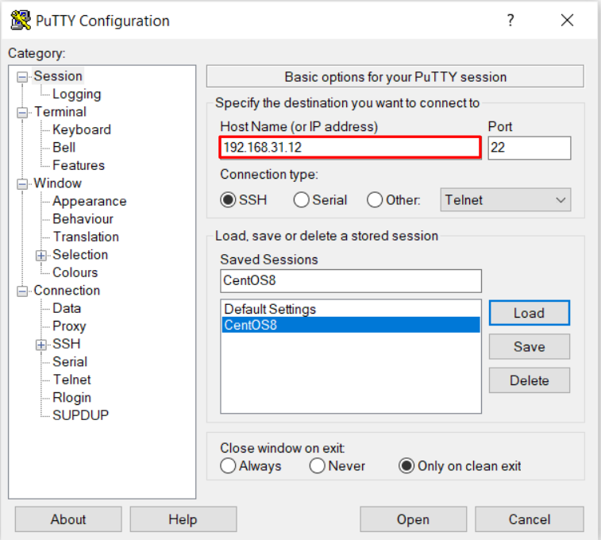
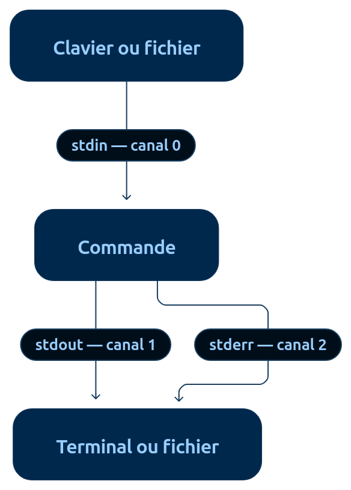

### Accès à distance en SSH avec PuTTY 
Le plus célèbre sous Windows est sûrement PuTTY

### Commandes fondamentales Linux
bin : contient des programmes (exécutables) susceptibles d'être utilisés par tous les utilisateurs de
la machine.
boot : fichiers permettant le démarrage de Linux.
dev : fichiers contenant les périphériques.
etc : fichiers de configuration.
home : répertoires personnels des utilisateurs. 
lib : dossier contenant les bibliothèques partagées (généralement des fichiers .so) utilisées par les
programmes. C'est en fait là qu'on trouve l'équivalent des .dll de Windows
### La boucle universelle de diagnostic 
1. Cadrer : quel service, quels utilisateurs, depuis quand, après quel changement ?
2. Observer : état, métriques, journaux, événements, dépendances. Ne rien modifier au début.
3. Localiser : hôte, processus, socket, réseau, DNS, TLS, stockage, dépendance ou application.
4. Formuler une hypothèse testable : « si X est la cause, alors Y doit être observable ».
5. Tester avec la commande la moins intrusive possible.
6. Corriger ou contourner par une action ciblée, réversible et autorisée.
7. Vérifier du point de vue utilisateur, surveiller la stabilité, puis documenter.
### Les règles d’or de production
• Toujours connaître l’environnement courant : identité, hôte, session, distribution, noyau,
répertoire et privilèges.
• Lire avant d’écrire : status, show, get, list, test et --dry-run avant restart, reload, remove ou mkfs.
• Copier explicitement les identifiants critiques ; ne pas dépendre d’un glob, d’une variable vide ou
d’un nom ambigu.
• Préserver un chemin de retour : sauvegarde, snapshot, ancienne release, configuration
précédente, commande de rollback.
• Capturer l’heure en UTC, les commandes exécutées et les résultats importants.
• Ne jamais coller en production une commande que l’on ne peut pas expliquer token par token.
• Ne jamais confondre « le processus tourne » avec « le service fonctionne » : vérifier une requête
réelle et ses dépendances.
### 1.2 Code de retour et enchaînements
comma de_a && comma de_b # b seuleme t si a réussit
comma de_a || comma de_b # b seuleme t si a échoue
comma de_a ; comma de_b # b da s tous les cas

if systemctl is-active --quiet nginx; then
    printf '%s\n' 'nginx actif'
else
    printf '%s\n' 'nginx inactif' >&2
    exit 1
fi
### 1.3 Entrée, sortie et erreurs
