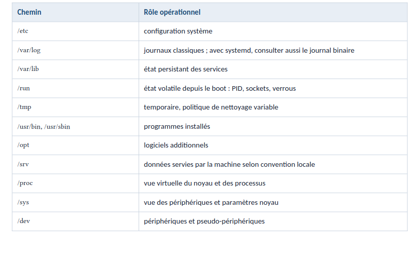

### Accès à distance en SSH avec PuTTY 
Le plus célèbre sous Windows est sûrement PuTTY

### Commandes fondamentales Linux
bin : contient des programmes (exécutables) susceptibles d'être utilisés par tous les utilisateurs de
la machine.
boot : fichiers permettant le démarrage de Linux.
dev : fichiers contenant les périphériques.
etc : fichiers de configuration.
home : répertoires personnels des utilisateurs. 
lib : dossier contenant les bibliothèques partagées (généralement des fichiers .so) utilisées par les
programmes. C'est en fait là qu'on trouve l'équivalent des .dll de Windows
### La boucle universelle de diagnostic 
1. Cadrer : quel service, quels utilisateurs, depuis quand, après quel changement ?
2. Observer : état, métriques, journaux, événements, dépendances. Ne rien modifier au début.
3. Localiser : hôte, processus, socket, réseau, DNS, TLS, stockage, dépendance ou application.
4. Formuler une hypothèse testable : « si X est la cause, alors Y doit être observable ».
5. Tester avec la commande la moins intrusive possible.
6. Corriger ou contourner par une action ciblée, réversible et autorisée.
7. Vérifier du point de vue utilisateur, surveiller la stabilité, puis documenter.
### Les règles d’or de production
• Toujours connaître l’environnement courant : identité, hôte, session, distribution, noyau,
répertoire et privilèges.
• Lire avant d’écrire : status, show, get, list, test et --dry-run avant restart, reload, remove ou mkfs.
• Copier explicitement les identifiants critiques ; ne pas dépendre d’un glob, d’une variable vide ou
d’un nom ambigu.garde, snapshot, ancienne release, configuration
précédente, commande de rollback.
• Préserver un chemin de retour : sauve
• Capturer l’heure en UTC, les commandes exécutées et les résultats importants.
• Ne jamais coller en production une commande que l’on ne peut pas expliquer token par token.
• Ne jamais confondre « le processus tourne » avec « le service fonctionne » : vérifier une requête
réelle et ses dépendances.
### 1.2 Code de retour et enchaînements
comma de_a && comma de_b # b seuleme t si a réussit
comma de_a || comma de_b # b seuleme t si a échoue
comma de_a ; comma de_b # b da s tous les cas

if systemctl is-active --quiet nginx; then
    printf '%s\n' 'nginx actif'
else
    printf '%s\n' 'nginx inactif' >&2
    exit 1
fi
### 1.3 Entrée, sortie et erreurs

Syntaxe	Signification
< fichier	utiliser le fichier comme entrée
> fichier	enregistrer stdout en remplaçant
>> fichier	ajouter stdout à la fin
2> fichier	enregistrer stderr en remplaçant
2>> fichier	ajouter stderr à la fin
> fichier 2>&1	enregistrer stdout et stderr ensemble
&> fichier	raccourci Bash pour les deux sorties
a | b	envoyer stdout de A vers stdin de B
2>&1 | tee fichier	afficher et enregistrer les deux sorties

commade >sortie.txt # remplace stdout
commade >>sortie.txt # ajoute stdout
commade 2>erreurs.txt # remplace stderr
commade >tout.log 2>&1 # stdout puis stderr vers le même finchier
commade &>tout.log # raccourci Bash
commade </chemi /e tree # stdi depuis u finchier
commade | autre # stdout devie t stdi de l’autre comma de
commade 2>&1 | tee tout.log # voir et e registrer stdout + stderr
### Hiérarchie à connaître

### 2.2 Navigation et inspection
stat /etc/passwd
file /usr/bin/ssh
readlink -f /var/run
realpath ./chemin/../cible
Commande	Question à laquelle elle répond
stat	Quelles sont les métadonnées du fichier ?
file	Quel est réellement le type du fichier ?
readlink -f	Où mène réellement ce chemin ou ce lien ?
realpath	Quel est le chemin absolu et normalisé ?

### 2.3 Créer, copier, déplacer, lier
sudo install -d -m 0750 -o myapp -g myapp /var/lib/myapp
Crée /var/lib/myapp, donne-le à l’utilisateur et au groupe myapp, accorde tous les droits au propriétaire, lecture et traversée au groupe, et aucun droit aux autres utilisateurs.

cp fichier destination       # peut remplacer sans demander
cp -i fichier destination    # demande avant de remplacer
cp -n fichier destination    # refuse de remplacer

Différence entre lien dur et lien symbolique
Propriété	Lien dur	Lien symbolique
Commande	ln cible lien	ln -s cible lien
Même inode que la cible	Oui	Non
Peut viser un répertoire	Généralement non	Oui
Peut traverser des systèmes de fichiers	Non	Oui
Fonctionne si le premier nom est supprimé	Oui	Non, si c’était sa cible
Peut pointer vers une cible inexistante	Non	Oui
Contient un chemin vers la cible	Non	Oui

On peut retenir cette image mentale :

un lien dur est un deuxième nom pour les mêmes données ;
un lien symbolique est un raccourci contenant le chemin vers une autre cible.

### 2.4 Supprimer sans catastrophe

# 1. Vérifier
find /srv/myapp/cache -type f -mtime +14 -print

# 2. Supprimer seulement après vérification
find /srv/myapp/cache -type f -mtime +14 -delete

###  2.5 Rechercher efficacement
Commande	Résultat
find /etc -type f -name '*.conf'	fichiers ordinaires terminant par .conf
find /var/log/myapp -type f -mmin -30 -size +10M -print	fichiers de plus de 10 Mio modifiés récemment
find /srv -xdev -type f -user olduser -print	fichiers appartenant à olduser, sans changer de système de fichiers
find /tmp -type f -empty -print	fichiers ordinaires vides
find /srv/app -type f -name '*.log' -exec gzip {} +
Avec -exec, on appeler une commande qui effectuera une action sur chacun des fichiers trouvés. 
find -name "*.sh" -exec chmod 600 {} \;

Contrairement à la commande find, la commande locate utilise une base de données. Cela 
permet d'obtenir un résultat plus rapide. Cette base de données est mise à jour par la cron. Mais il 
est possible de forcer manuellement la mise à jour de cette base avec la commande updatedb
Son utilisation est intuitive, il suffit d'indiquer le nom du fichier que vous voulez retrouver
locate fichier.txt

### 2.6 Taille, blocs et inodes
df -hT                              # quel système de fichiers est plein ?
df -ih                              # les inodes sont-ils épuisés ?
du -xhd1 /var | sort -hr            # quel répertoire utilise l’espace ?
du -xah /var/log | sort -h | tail   # quels éléments sont les plus gros ?
stat fichier                        # quelles sont les propriétés d’un fichier ?
du -h --max-depth=1 | sort -nr

lsof /var/log/app.log
car le chemin n’existe plus. Dans ce cas, il faut utiliser :
sudo lsof +L1
À retenir :
rm supprime le nom du fichier. Si un processus garde encore son inode ouvert, les données et l’espace disque restent présents jusqu’à la fermeture du fichier.

### 1.25 Extraire, trier et filtrer les données
-i : ne pas tenir compte de la casse (majuscules / minuscules)
grep -i texte nomfichier
Si, au contraire, on souhaite connaître toutes les lignes qui ne contiennent pas un mot donné, 
utilisez -v 
grep -v texte nomfichier
-r : rechercher dans tous les fichiers et sous-dossiers
grep -r texte nomfichier

### Utilisateurs et groupes
Pour ajouter un utilisateur, on utilise la commande useradd
Les utilisateurs sont stockés dans le fichier /etc/passwd
passwd utilisateur
userdel -r utilisateur
groups utilisateur
usermod -G grafana utilisateur
Ajouter un utilisateur à un groupe existant (en conservant les groupes actuels auxquels 
appartient l'utilisateur)
usermod -aG prometheus utilisateur
Gestion des utilisateurs avec des privilèges sudo 
usermod -aG wheel utilisateur

### 1.30 Groupes
Les groupes sont disponibles dans le fichier /etc/group
groupadd groupe
groupdel groupe
Supprimer l'utilisateur du groupe: gpasswd -d utilisateur grafana

### Droits sous Linux
# Lire ses droits
rwxr-xr--
\ /\ /\ /
v v v
| | droits des autres utilisateurs (o)
| |
| droits des utilisateurs appartenant au groupe (g)
|
droits du propriétaire (u)

r= 4 si actif ou 0 si inactif
w = 2 si actif ou 0 si inactif
x = 1 si actif ou 0 si inactif
Ainsi, rwx « vaut » 7 (4+2+1), r-x « vaut » 5 (4+1) et r-- « vaut » 4. Les droits complets (rwxr-xr--) 
sont donc équivalent à 754
-rw-r--r-- 1 adriencl users 8 1 janv. 12:56 fichier
• d : répertoire
• l : lien symbolique
• c : périphérique de type caractère
• b : périphérique de type bloc
• p : fifo
• s : socket
• - : fichier classique
# Ajouter ou ôter des droits
Pour ajouter le droit de lecture à tout le monde sur mon fichier  : chmod a+r fichier
Pour ajouter le droit de modification au groupe  : chmod g+w fichier
Pour retirer le droit de lecture aux autres : chmod o-r fichier
#  Changer les utilisateurs et groupes sur les fichiers
Pour changer le possesseur du fichier, on utilise la commande chown
Si on veut le faire de manière récursive, on utilise -R
Changer le groupe uniquement, c'est la commande chgrp

###  La commande sed
Lecture d’un fichier
sed '' fichier.txt

La commande d (delete)
sed -e '2 d; 4 d' fichier.txt
On peut aussi utiliser l'adressage par intervalle
sed '2,3 d' fichier.txt
 on supprimera toutes les lignes commençant par la lettre « L » (le ^
est un métacaractère signifiant début de ligne)
sed '/^L/ d' fichier.txt
supprimera toutes les lignes comprises entre Ligne début et 'Ligne 
fin', donc tout le fichier.
sed '/^Ligne debut/,/^Ligne fin/d' fichier.txt
 La commande p (print)
 sed -n '1,4p' fichier.txt
 Seules les lignes contenant le motif seront affichées
sed -n '/Li/p' fichier.txt
La commande w (write)
Stocker dans le fichier "resultat.txt " toutes les lignes qui commencent par « Li »
sed -n '/Li/w resultat.txt' fichier.txt
 Négation d'une commande (!)
 Le caractère ! placé devant une commande permet d'exécuter cette dernière sur toutes les lignes 
sauf sur celles correspondant à la partie adresse.
sed -n '/Li/!p' fichier.txt
La commande s (substitution)
sed 's/Ligne/Test/' fichier.txt
### 1.27 La commande AWK
Imprimer la première colonne du fichier « fichier » et supprimer le reste des colonnes 
awk '{print $1}' fichier
Imprimer la première et la troisième colonne du fichier « fichier » et supprimer le reste des 
colonnes
awk '{print $1, $3}' fichier
# dentificateurs de champ spéciaux
• $0: Représente toute la ligne de texte.
• $1: Représente le premier champ.
• $2: Représente le deuxième champ.
• $7: Représente le septième champ.
• $45: Représente le 45e champ.
• $NF: Signifie «nombre de champs» et représente le dernier champ.
Imprimer la première et la dernière colonne du fichier « fichier » et supprimer le reste des 
colonnes
awk '{print $1, $NF}' fichier
Imprimer le nombre total de lignes du fichier
awk 'END {print NR}' fichier
Imprimer les lignes de plus de 75 caractères.
awk 'length($0)>50 {print}' fichier
# Ajout de séparateurs de champ de sortie
date | awk '{print $2,$3,$6}'
Nous utiliserons ensuite le OFS (séparateur de champ de sortie) pour placer un séparateur entre le 
mois, le jour et l'année.
date | awk 'OFS="/" {print$2,$3,$6}'
# Les règles BEGIN et END
BEGIN est exécutée une fois avant le début du traitement de texte. END la règle est exécutée une 
fois tout le traitement terminé. Vous pouvez avoir plusieurs BEGIN et END règles, et ils 
s'exécuteront dans l'ordre.
awk 'BEGIN {print "Avant traitement"} {print 
$1}' fichier
awk 'END {print "Après traitement"} {print 
$1}' fichier
#  Séparateurs de champ d'entrée
our manipuler des fichiers qui utilise un séparateur diffèrent de celui par défaut « espace », il 
faut indiquer quel caractère le texte utilise comme séparateur de champ. Par exemple, 
le /etc/passwd le fichier utilise deux points (:) pour séparer les champs.
Nous utiliserons ce fichier et l’option -F (chaîne de séparation) option pour dire awk d'utiliser les 
deux points (:) comme séparateur. 
Imprimer le nom du compte utilisateur et du dossier personnel 
awk -F: '{print $1,$6}' /etc/passwd
# Ajout d’un filtre 
Imprimer uniquement les lignes dont le troisième champ ($3) contient une valeur de 1 000 ou plus 
awk -F: '$3 >= 1000 {print $1,$3,$6}'  /etc/passwd
### Tar : décompresser des fichiers
• tar est un logiciel d’archivage qui permet de combiner plusieurs fichiers en un seul.
• gzip est un logiciel de compression utilisé pour réduire la taille d’un fichier.
• tar et gzip sont utilisés ensemble pour créer des archives compressées.
• .tar : fichier d’archive non compressé.
• .gz : fichier (archive ou non) compressé avec gzip.
• .tar.gz : fichier d’archive compressé avec gzip.
• Il existe également d’autres logiciels de compression comme bzip2 et xz qui 
compressent les archives en utilisant d’autres algorithmes de compression.
# 1.28.2 Archivage avec "tar"
tar -vcf archive.tar fichier1 fichier2
-v : (verbose/parlant) permet d'obtenir une description du contenu archivé (facultatif)
-c : (create/créer) pour créer une archive
-f : (file/fichier) pour spécifier un nom pour l'archive (en paramètre)
# 1.28.3 Archivage et compression avec l’algorithme gzip
tar -czvf archive.tar.gz fichier1 fichier2
–c : crée une archive.
–z : compresse l’archive avec gzip. 
–v : mode verbeux, affiche la progression.
–f : permet de spécifier le nom du fichier d’archive.
Compression xz
tar -cJvf archive.tar.xz fichier1 fichier2
Compression bzip2
tar -cjvf archive.tar.bz2 fichier1 fichier2
### Décompresser une archive
tar -xzvf archive.tar.gz
Pour extraire le contenu de l’archive dans un répertoire spécifique, il faudra ajouter l’option -C
tar -xzvf archive.tar.gz -C data/
bzip2
tar -xjvf archive.tar.bz2
xz
tar -xJvf archive.tar.xz
Pour visualiser le contenu de l’archive sans la décompresser, on utilise l'option -t
tar -tf archive.tar
### LVM : Gestionnaire de volumes logiques
Niveau	Signification	Commandes principales
PV	Physical Volume	pvcreate, pvs, pvdisplay
VG	Volume Group	vgcreate, vgs, vgdisplay, vgextend
LV	Logical Volume	lvcreate, lvs, lvdisplay, lvextend
L’objectif de LVM est de fournir une couche d’abstraction entre le système de fichiers (Ext2/3/4, 
XFS, ReiserFS, FAT, NTFS, …) et le disque physique sur lequel il repose.
.png)
## 1.39 Installation des outils LVM
sudo apt-get install lvm2
# 1.40 PV
# 1.40.1 Création PV
pvcreate /dev/sdb 
Pour afficher la liste des PV présent sur le système, on utilise la commande pvs
pvs
Suppression PV
pvremove /dev/sdb 
1.41.1 Création VG
vgcreate /dev/sda2
Informations VG
Pour afficher la liste des VG présent sur le système, on utilise la commande vgs
Pour afficher des infos sur un VG particulier, on utilise la commande pvdisplay
vgdisplay datavg
Suppression VG
vgremove datavg 
 Agrandir un VG
 vgextend datavg /dev/sda
1.42.1 Création LV
Pour créer un LV, on va utiliser la commande lvcreate: 
lvcreate -n monlv -L 100M datavg
ou 
lvcreate -n pourcentlv -l 10%VG datavg
Informations LV
Pour afficher la liste des LV présent sur le système, on utilise la commande lvs
Pour afficher des infos sur un LV particulier, on utilise la commande lvdisplay
lvdisplay /dev/datavg/home
La commande lsblk permet d’affiche l’arborescence des lv
lsblk
1.42.3 Suppression VG
Pour supprimer un LV, on utilise la commande lvremove.
 lvremove /dev/datavg/pourcentlv
lvresize -L 200M /dev/datavg/monlv
1.42.5 Formatage et montage du système de fichiers
Afin de pouvoir monter le volume logique, il est nécessaire de le formater auparavant, via les 
commandes mkfs. Par exemple, pour formater en ext4, on utilisera la commande 
mkfs -t ext4 /dev/datavg/monlv
Pour créer le FS, il faudra disposer d’un point de montage ou en créer si nécessaire
mkdir /mnt/lvm-data
Monter le Logical Volume
mount /dev/datavg/monlv /mnt/lvm-data/
Démonter un système de fichiers
umount /mnt/lvm-data
1.42.6 Fichier fstab (montage automatique)
Le fichier /etc/fstab liste les partitions qui seront montées automatiquement au démarrage ou 
à la connexion du périphérique, avec toujours les mêmes options.
Il est composé de plusieurs lignes décrivant chacune les conditions de montage de chaque 
partition / système de fichier.

### Services sous Linux
 Démarrage et arrêt des services
 systemctl start node_exporter.service
 Arrêter un service en cours d’exécution
 systemctl stop node_exporter.service
 Redémarrage et rechargement des services
 systemctl restart
 Activation et désactivation des services
systemctl enable node_exporter.service
Désactiver le démarrage d'un service au démarrage du système:
systemctl disable node_exporter.service
Affichage de l'état du service
systemctl status node_exporter.service
Vérifier si un service est actif
systemctl is-active node_exporter.service
Vérifier si un service est activé
systemctl is-enabled
 Affichage de l'état du système
  Lister tous les services installés
systemctl list-unit-files -t service
Pour voir tous les types d'unités
systemctl -t help

### Commande ssh
SSH, ou « Secure Shell », est un protocole que vous pouvez utiliser pour accéder à des fichiers et 
des répertoires sur un serveur distant.
# 1.42.9 Configuration de la connexion
Pour l’authentification et la configuration de la connexion, vous devrez générer une paire de clés 
ssh dans le terminal en utilisant la commande suivante :
ssh-keygen -t rsa
Puis, copiez cette clé sur le système distant en utilisant :
ssh-copy-id utilisateur@machine_distante
# scp : transfert de fichier à travers une connexion ssh
scp -r -p user@serveur1:chemin/vers/dossier/source 
user@serveur2:chemin/vers/dossier/destination
Options
• -P permet de spécifier un port différent au serveur (le port TCP par défaut pour la 
commande est 22)
• -c vous donne la possibilité de spécifier l’algorithme de cryptage que le client utilisera. 
Parmi les valeurs que vous pouvez utiliser, on trouve ‘aes256-ctr’, ‘aes256-cbc’, 
‘blowfish-cbc’, ‘arcfour’, ‘arcfour128’, ‘arcfour256’, ‘cast128-cbc’, aes128-ctr’, ‘aes128-
cbc’, ‘aes192-ctr’, ‘aes192-cbc’, et 3des-cbc’. L’option par défaut dans la configuration 
du shell est « AnyStdCipher ».
• -q fera fonctionner l’opération en mode silencieux, ce qui signifie que seules les 
erreurs critiques seront affichées.
• -r est pour la copie récursive, qui comprendra tous les sous-répertoires.
• -p préservera les temps de modification et les attributs initiaux du fichier.
• -u supprimera le fichier source une fois le transfert terminé.
• -c permettra la compression des données pendant l’opération de transfert.
### SFTP : transfert des fichiers avec un serveur distant
sftp user@your_server_ip_or_remote_hostname
sftp -oPort=custom_port user@your_server_ip_or_remote_hostname
# Transférer des fichiers distants vers le système local
Pour télécharger des fichiers à partir de notre hébergement local, vous pouvez passer la 
commande suivante
get remoteFile
Nous pouvons copier le fichier distant en utilisant un autre nom, en spécifiant le nom par la suite :
get remoteFile localFile
get -r someDirectory
Nous pouvons dire au SFTP de maintenir les autorisations et les temps d'accès appropriés en 
utilisant la balise -P ou -p :
get -Pr someDirectory
Il est tout aussi facile de transférer des fichiers vers le système distant en utilisant la commande 
qui s'appelle, à juste titre, « put » :
put localFile
### Crontab
# Afficher le contenu du fichier crontab
crontab -l
# Editer la crontab
crontab -e
# Supprimer toutes les actions du fichier crontab
crontab -r
Les Cron jobs sont enregistrés et gérés dans un fichier spécial appelé crontab
.png)
mm hh jj MMM JJJ [user] tâche 
• mm : minutes (00-59).
• hh : heures (00-23) .
• jj : jour du mois (01-31).
• MMM : mois (01-12 ou abréviation anglaise sur trois lettres : jan, feb, mar, apr, may, jun, 
jul, aug, sep, oct, nov, dec).
• JJJ : jour de la semaine (1-7 ou abréviation anglaise sur trois lettres : mon, tue, wed, thu, fri, 
sat, sun).
• user (facultatif) : nom d'utilisateur avec lequel exécuter la tâche.
• tâche : commande à exécuter.
Exécution d’un script tous les jours à 22h00
00 22 * * * /home/centos/test.sh
### 9. Réseau Linux, DNS, TLS et HTTP
# 9.2 Interfaces, adresses et routes
ip -br link # état des interfaces
ip -br addr # adresses IP
ip addr show dev eth0 
ip route # chemins/routage
ip -6 route
ip route get 203.0.113.10 # chemin choisi pour UNE destination
ip neigh # correspondances IP ↔ MAC sur le réseau local
# 9.3 Sockets et ports
Un service qui écoute seulement sur 127.0.0.1:8080 n’est pas joignable directement via l’IP externe.
0.0.0.0:8080 écoute sur toutes les adresses IPv4 locales ; [::]:8080 concerne IPv6 et, selon la configuration,
peut aussi accepter IPv
ss -lntup
ss -lntp 'sport = :443'
ss -tan state established
ss -s
lsof -nP -iTCP:8080 -sTCP:LISTEN    